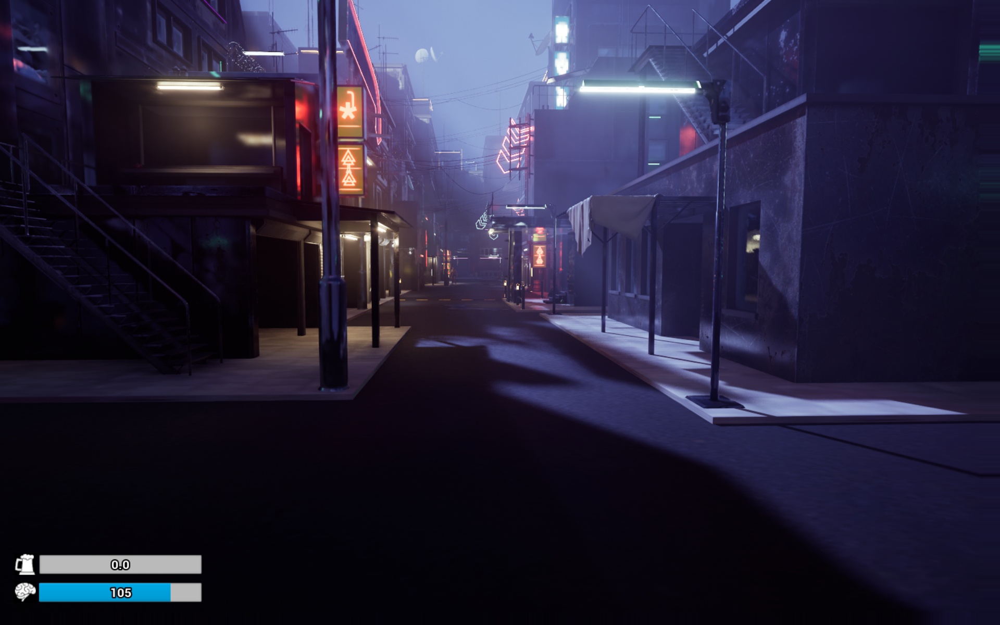
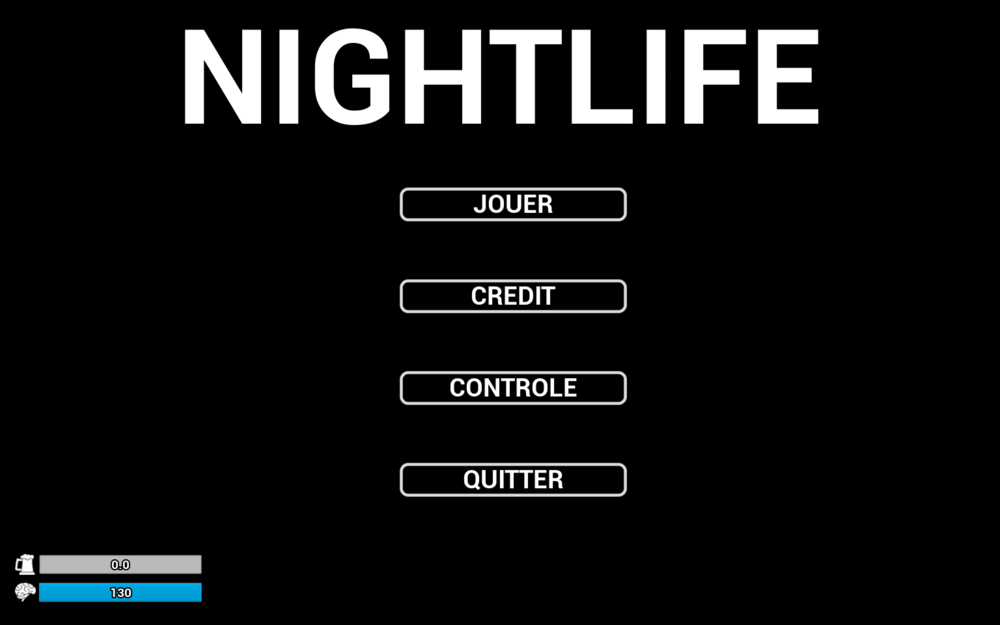

# NightLife

Welcome to NightLife! This project is a video game developed in five days as part of a hackathon.

The goal was to create a project in five days based on a given theme : nightlife. Our team chose to develop a unique video game using Unreal Engine 5.

---

## Game Overview

NightLife is a 3D first-person video game centered around nightlife and the choices players make throughout their adventure. 

The game begins in a nightclub. From the start, players can explore the environment and make their first choices. They can talk to partygoers, grab a drink at the bar, or even pick a fight with the bouncer - if they dare!

Once outside the club, the player must find their way home, wandering through the city in the dead of night. However, unexpected events await them on their journey...

The game features immersive audio, with all voices in French, enhancing the comedic and absurd atmosphere.

NightLife is filled with Easter eggs and inside jokes, making it a fun and unpredictable experience. 

This game exists purely for entertainment; it is intentionally wacky and borderline ridiculous. It is not meant to provoke deep thought - only laughter!

---

## Installation 🔧

To play NightLife, follow these steps:

1. Download the ZIP file from the following link:  
   [Download NightLife](https://drive.google.com/drive/folders/1wRY7lEiEhzWeysjI27b1hX6zzoCVHqxm?usp=sharing)
2. Extract the downloaded files.
3. Launch `NightLife.exe` and enjoy the game!

---

## How to Play? 🎮

Upon launching the game, you will arrive at the main menu. 
- The "Controls" tab provides an overview of the keybindings.
- Click "Play" to start your adventure.

---

## Authors 👥

- [Hugo Flandrin](https://github.com/HugoFlandrin)
- [Quentin Gros](https://github.com/quent1grs)
- [Yael Girard](https://github.com/3Mcrystal)
- [Soleane Rivier](https://github.com/Talienhyung)

---

Enjoy your adventure in NightLife! 🌙

