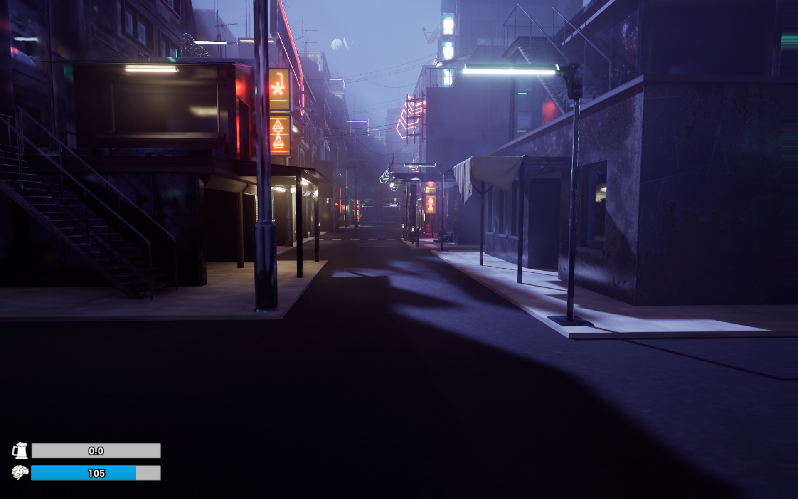
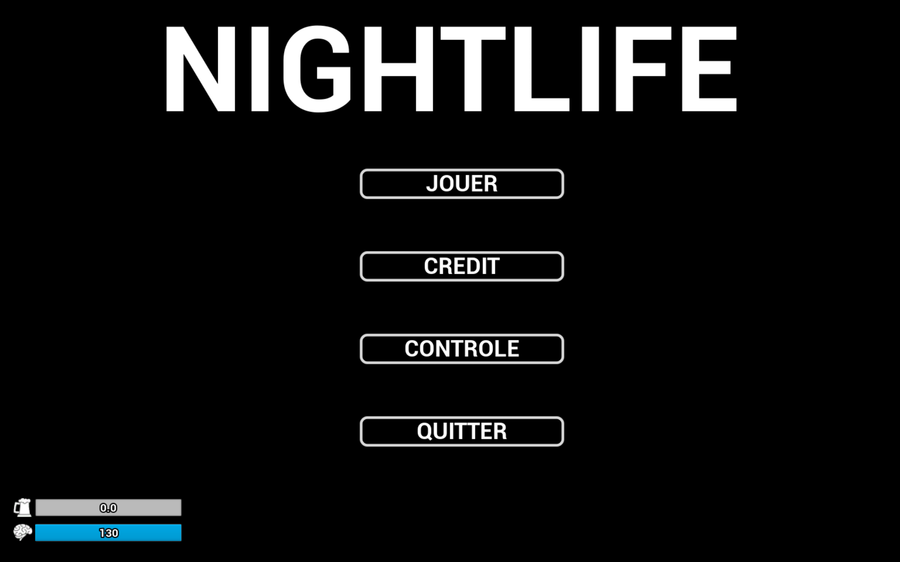

# NightLife

Bienvenue sur NightLife ! Ce projet est un jeu vidéo développé en cinq jours dans le cadre d'un hackathon.

L'objectif était de créer un projet en cinq jours à partir d'un thème donné : nightlife. Notre équipe a choisi de développer un jeu vidéo original avec Unreal Engine 5.

---

## Présentation du jeu

NightLife est un jeu vidéo 3D à la première personne centré sur la vie nocturne et les choix que font les joueurs au fil de leur aventure.

Le jeu commence dans une boîte de nuit. Dès le départ, les joueurs peuvent explorer l'environnement et faire leurs premiers choix. Ils peuvent parler aux fêtards, prendre un verre au bar, ou même chercher la bagarre avec le videur — s'ils l'osent !

Une fois sorti de la boîte, le joueur doit retrouver son chemin jusque chez lui, errant à travers la ville en pleine nuit. Cependant, des événements inattendus l'attendent au cours de son périple...

Le jeu propose un son immersif, avec toutes les voix en français, renforçant l'atmosphère comique et absurde.

NightLife est rempli d'easter eggs et de private jokes, ce qui en fait une expérience amusante et imprévisible.

Ce jeu existe purement pour le divertissement ; il est volontairement déjanté et à la limite du ridicule. Il n'a pas vocation à faire réfléchir, seulement à faire rire !

---

## Installation 🔧

Pour jouer à NightLife, suivez ces étapes :

1. Téléchargez le fichier ZIP depuis le lien suivant :  
   [Télécharger NightLife](https://hugoflandrin.itch.io/nightlife)
2. Extrayez les fichiers téléchargés.
3. Lancez `NightLife.exe` et profitez du jeu !

---

## Comment jouer ? 🎮

Au lancement du jeu, vous arrivez sur le menu principal.
- L'onglet « Contrôles » présente un récapitulatif des touches.
- Cliquez sur « Play » pour démarrer l'aventure.

---

## Auteurs 👥

- [Hugo Flandrin](https://github.com/HugoFlandrin)
- [Quentin Gros](https://github.com/quent1grs)
- [Yael Girard](https://github.com/3Mcrystal)
- [Soleane Rivier](https://github.com/Talienhyung)

---

Profitez bien de votre aventure dans NightLife ! 🌙
